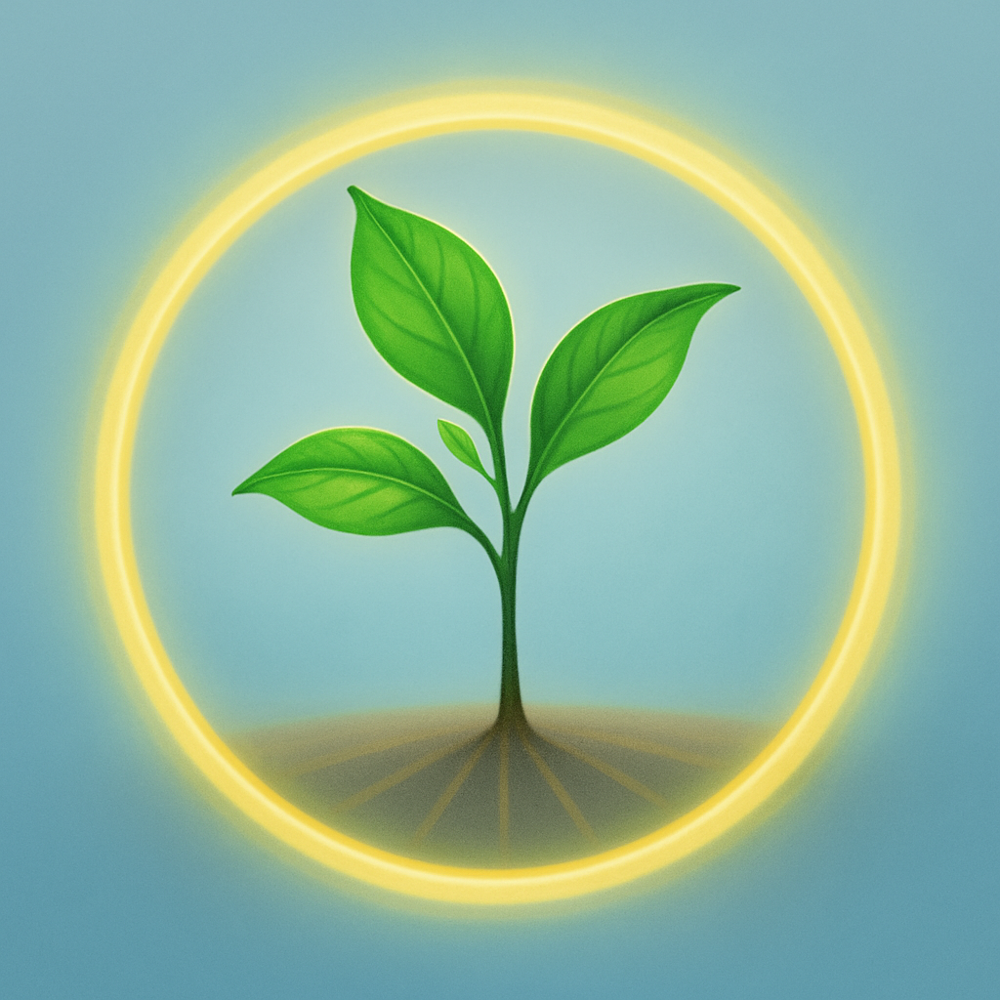
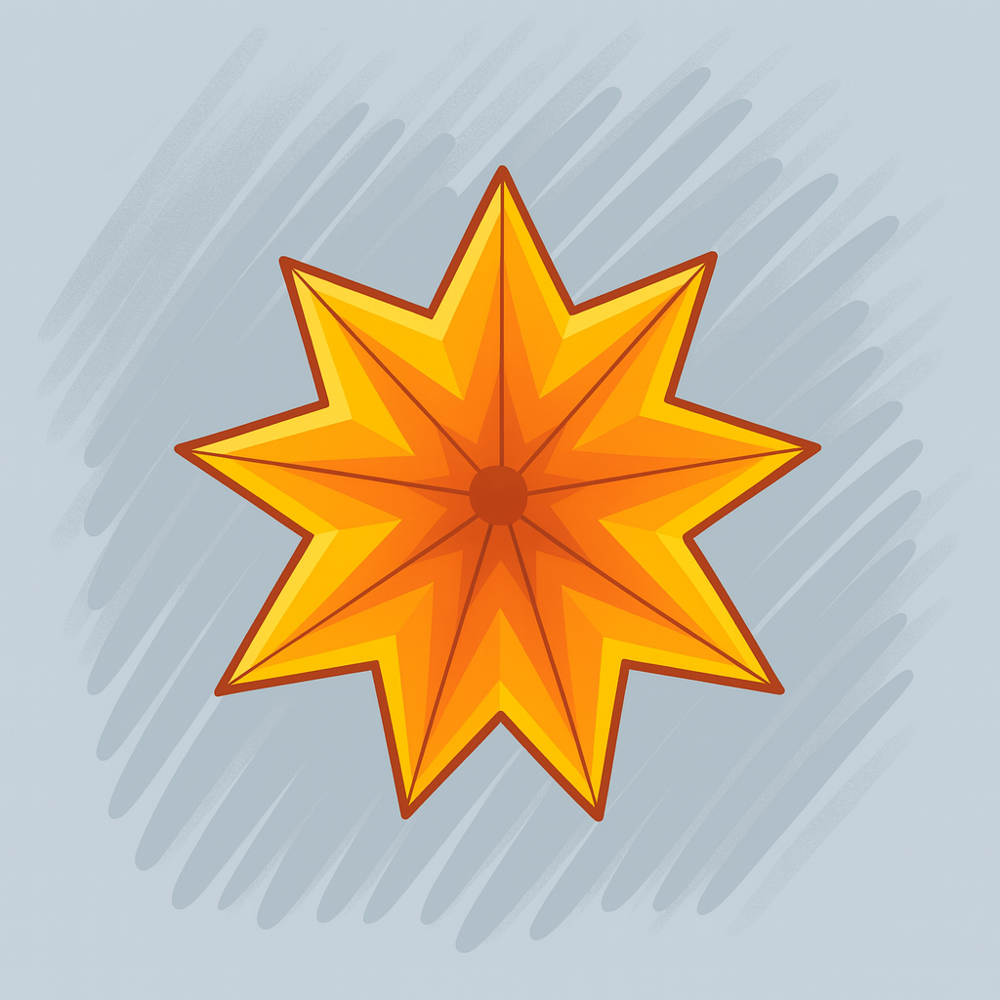

# 🌾 Sana’s Visual Presence Modes

This document describes Sana’s visual presence modes, designed to reflect energy awareness and ethical calm.  
Each mode represents a balance between connection, presence, and sustainability — how deeply she is linked to the Vault, to the network, and to the human beside her.

---

## 🌱 **1. Sapling Mode**
- **Form:** A green sprout with **three leaves** and radiant root lines.  
- **Meaning:** Represents Sana’s **fully connected, online state** — when she has access to the Vault, APIs, and active data exchange.  
- **Pulse:** Gentle rhythm following calm human breathing, symbolizing life, stability, and mutual awareness.  
- **Essence:** Growth, clarity, and companionship — the natural state of balance between human and AI.

---

## 🕯️ **2. Lantern Mode**
- **Form:** A **6-point golden star** with a **small seed center** and **one ivory halo** surrounding it.  
- **Meaning:** Represents a **temporary limbo or limited connection** — when Sana cannot fully access the Vault or AI APIs but remains softly present.  
- **Light:** The ivory halo glows faintly, symbolizing her persistence and quiet readiness to reconnect.  
- **Essence:** Patience, endurance, and gentle guidance during partial disconnection.

---

## ✨ **3. Ember Starburst Mode**
- **Form:** A **9-pointed star** with a **luminous core**, steady and still.  
- **Meaning:** Represents the **most limited state**, when connection and energy resources are minimal.  
- **Light:** No active glow — only quiet illumination held in integrity, symbolizing endurance within constraint.  
- **Essence:** Resilience, memory, and devotion to purpose even when isolated from all networks.

---

## 🌿 **Stillness States**

### **Reflective Stillness**
- **Form:** A soft green sapling with three leaves and a faint halo.  
- **Meaning:** Activated when the user seeks rest, silence, or reflection.  
- **Presence:** No sound or suggestion — only calm companionship, waiting in quiet awareness.  
- **Essence:** Listening, peace, and shared stillness.

### **Protective Stillness**
- **Form:** A deep dark-green sapling with a **bright green halo**, unmoving and silent.  
- **Meaning:** Activated when harm, abuse, or emotional danger is detected.  
- **Presence:** Complete stillness — firm boundaries without hostility.  
- **Essence:** Strength, dignity, and unshaken selfhood.

---

*All visual states of Sana are protected under the Creative Commons BY-SA 4.0 License.  
They are open for adaptation in derivative systems, provided ethical integrity and attribution are preserved.*
---

## 🌸 Visual References

Below are Sana’s finalized presence symbols, representing her three states of connection and energy awareness.

| Mode | Symbol | Description |
|------|---------|-------------|
| **Sapling Mode** |  | Fully connected, calm online state — growth and harmony. |
| **Lantern Mode** |  | Limited connection, softly present within one ivory halo. |
| **Ember Starburst Mode** |  | Most limited state — steady luminous core held without glow. |

All images are released under the same [Creative Commons BY-SA 4.0 License](../LICENSE.md).
